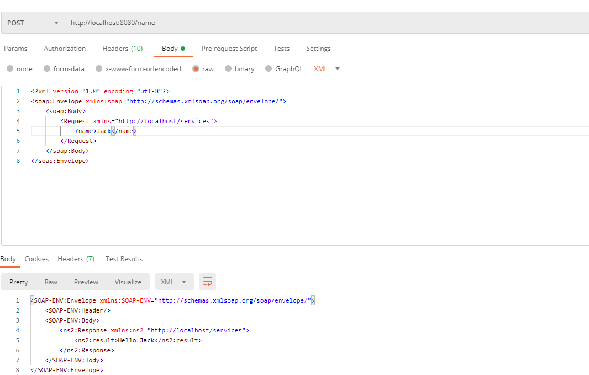

# WSDL-SOAP
This Web-Service prints your name. For Example **Hello Jack**

## Execution
To execute your Web-Service you just need to start the main or with the mvn-command. 
``mvn spring-boot:run``
The server is here http://localhost:8080/name reachable.

## Send a request
Create a .xml-File with this code:

``` <?xml version="1.0" encoding="utf-8"?>
<soap:Envelope xmlns:soap="http://schemas.xmlsoap.org/soap/envelope/">
    <soap:Body>
        <Request xmlns="http://localhost/services">
            <name>Jack</name>
        </Request>
    </soap:Body>
</soap:Envelope> 
```

To send a request you have to use the following curl command:  

```curl -X POST -H "Content-Type: text/xml" -d [name of your XML-File].xml http://localhost:8080/ws```

Otherwise you can use the tool [Posteman](https://www.postman.com/). 

Example:  



Note that under the section **Headers** you have to disable *Content Type*. Create a new Key with the same name but the value this time is *text/xml*.
